# Сервис пользователей

## Задача

Выполняет функцию **IdentityProvider**. Включает в себя авторизацию и администрирование пользователей. Написан на **Python**

## Список файлов

* [**certs**](./certs/)
  * [*jwks.json*](./certs/jwks.json) - файл с набором JWK ключей
* [**controller**](./controller/)
  * [*api.py*](./controller/api.py) - модуль, администрирующий все контроллеры в приложении
  * [*user.py*](./controller/user.py) - контроллер пользователя
* [**dto**](./dto/)
  * [*user.py*](./dto/user.py) - все (кроме бд) модели пользователя (в том числе авторизационные)
* [**exceptions**](./exceptions/)
  * [*handlers.py*](./exceptions/handlers.py) - функции, перехватывающие эксепшены
  * [*http.py*](./exceptions/http.py) - hhtp эксепшены
* [**model**](./model/)
  * [*user.py*](./model/user.py) - модель бд пользователя
* [**repository**](./repository/)
  * [*user.py*](./repository/user.py) - репозиторий пользователя
* [**schemas**](./schemas/)
  * [*api_responses.py*](./schemas/api_responses.py) - примеры апи ответов для в документации swagger
  * [*response.py*](./schemas/response.py) - описание ответов endpoint-ов
* [**service**](./service/)
  * [*user.py*](./service/user.py) - сервис пользователей
* [**utils**](./utils/)
  * [*addons.py*](./utils/addons.py) - вспомогательные функции
  * [*consts.py*](./utils/consts.py) - константы
  * [*enums.py*](./utils/enums.py) - enum-ы
  * [*jwks.py*](./utils/jwks.py) - функции работы с jwk
  * [*jwt.py*](./utils/jwt.py) - функции работы с jwt
  * [*settings.py*](./utils/settings.py) - настройки сервиса (глобальные настройки сервиса и бд идут из файла [**config.yaml**](/src/backend/config.yaml))
  * [*validate.py*](./utils/validate.py) - функции валидации
* [**main.py**](./main.py) - основной файл запуска сервиса

## Endpoint-ы

* <details>
  <summary> POST(/api/v1/user/login/) - логин </summary>
  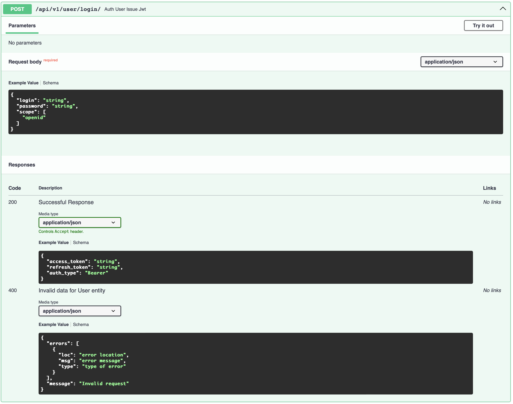
  </details>

* <details>
  <summary> POST(/api/v1/user/register/) - регистрация </summary>
  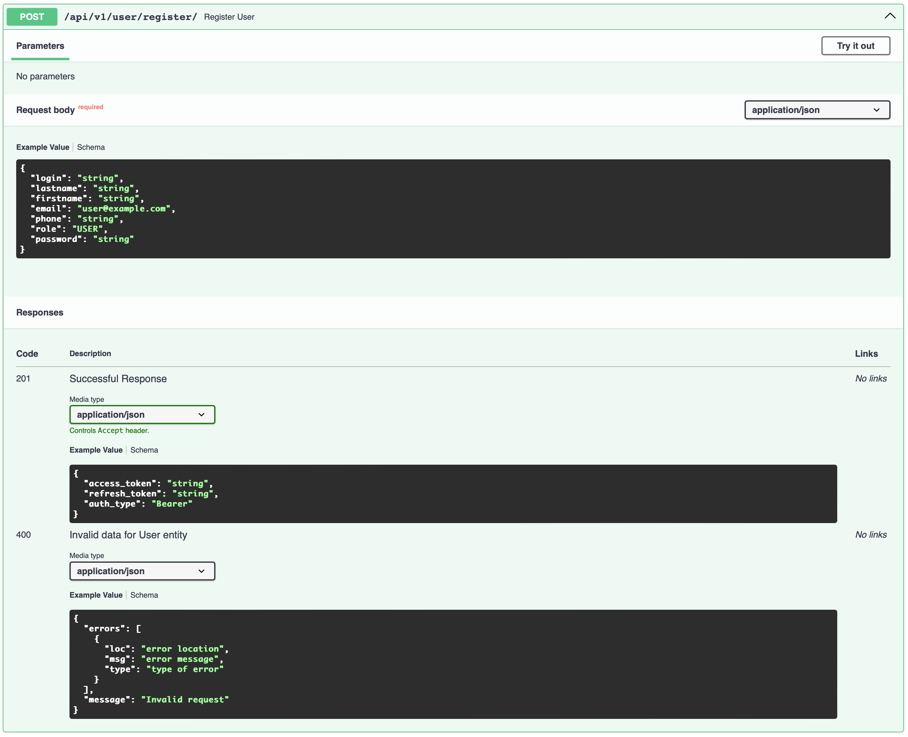
  </details>

* <details>
  <summary> POST(/api/v1/user/refresh/) - обновление токена </summary>
  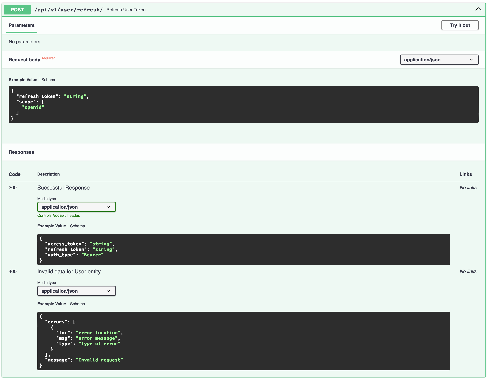
  </details>

* <details>
  <summary> GET(/api/v1/user/.well-known/jwks.json) - список ключей JWK </summary>
  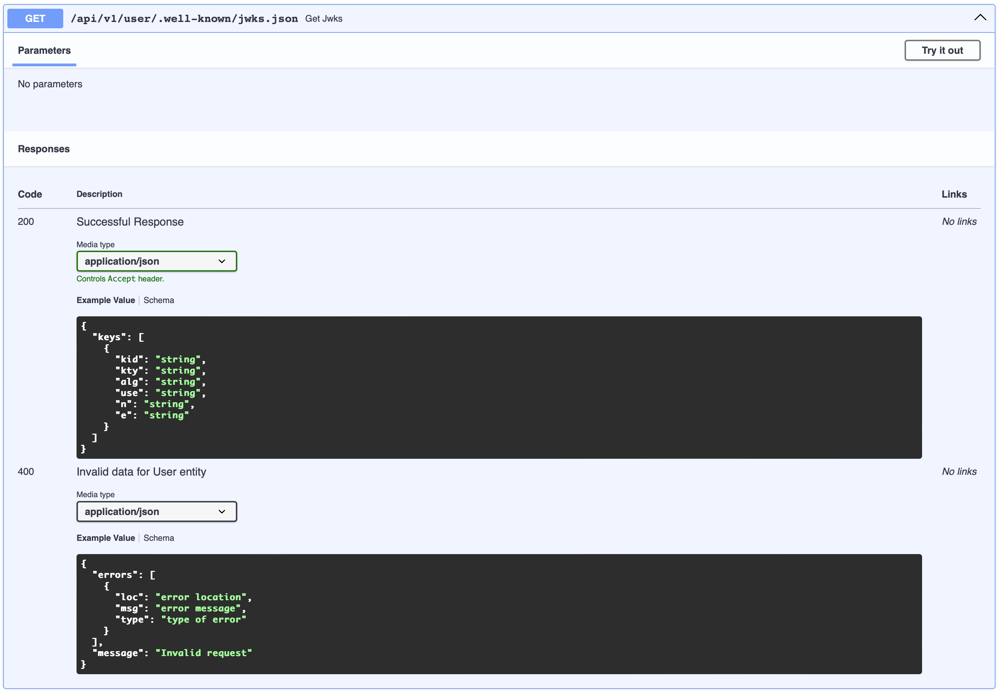
  </details>

* <details>
  <summary> GET(/api/v1/user/me/) - получить информацию о себе </summary>
  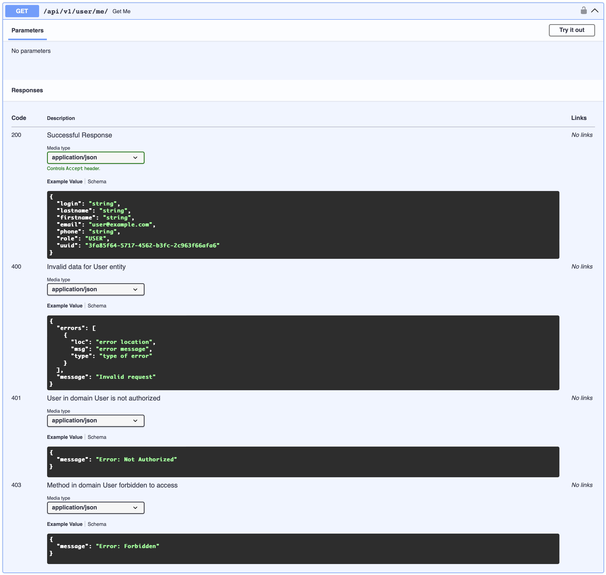
  </details>

* <details>
  <summary> PATCH(/api/v1/user/me/) - обновить информацию о себе </summary>
  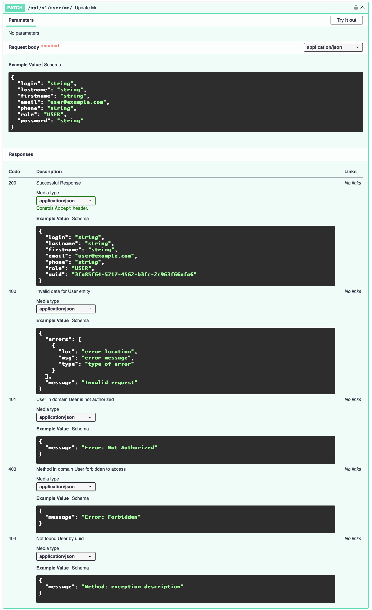
  </details>

* <details>
  <summary> GET(/api/v1/user/) - получить список пользователей по фильтрам </summary>
  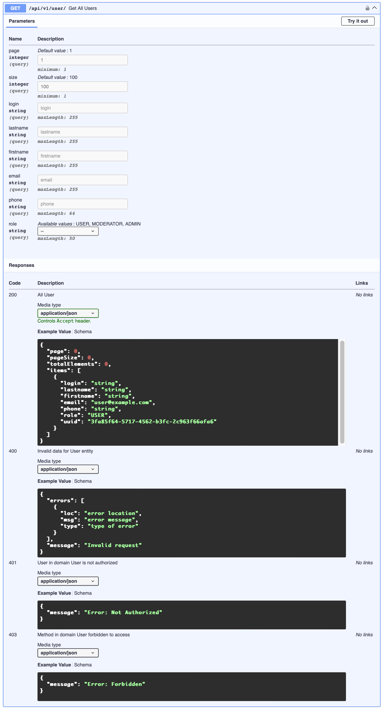
  </details>

* <details>
  <summary> POST(/api/v1/user/) - создать пользователя </summary>
  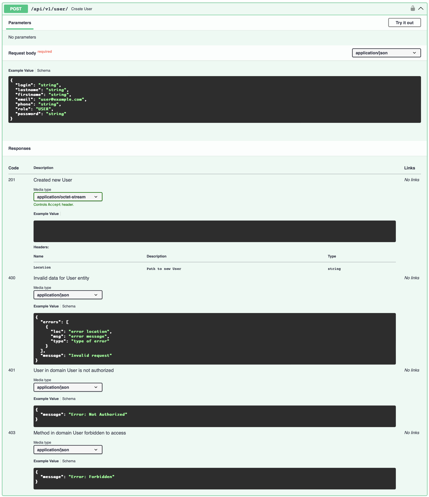
  </details>

* <details>
  <summary> GET(/api/v1/user/{uuid}) - получить пользователя по uuid </summary>
  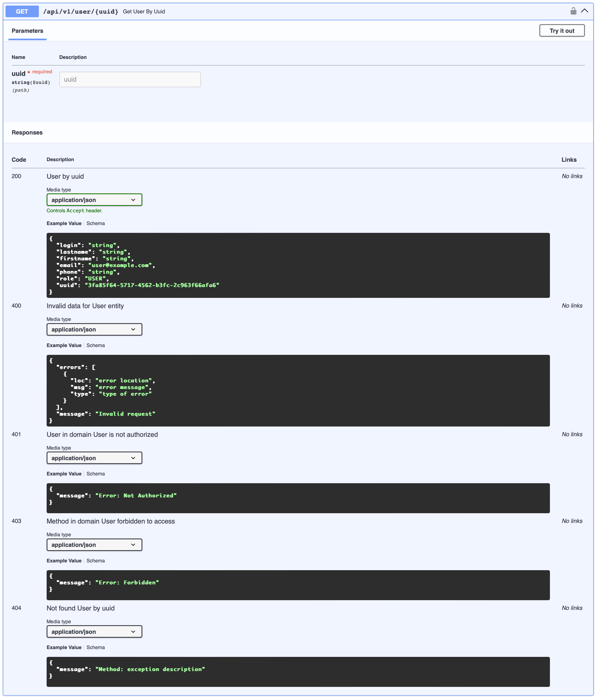
  </details>

* <details>
  <summary> PATCH(/api/v1/user/{uuid}) - обновить пользователя по uuid </summary>
  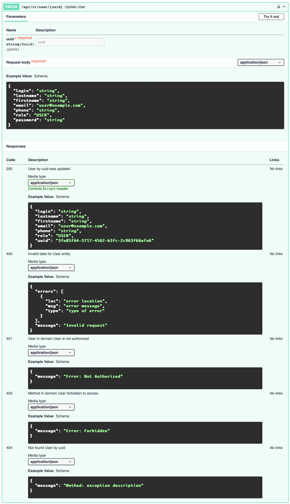
  </details>

* <details>
  <summary> DELETE(/api/v1/user/{uuid}) - удалить пользователя по uuid </summary>
  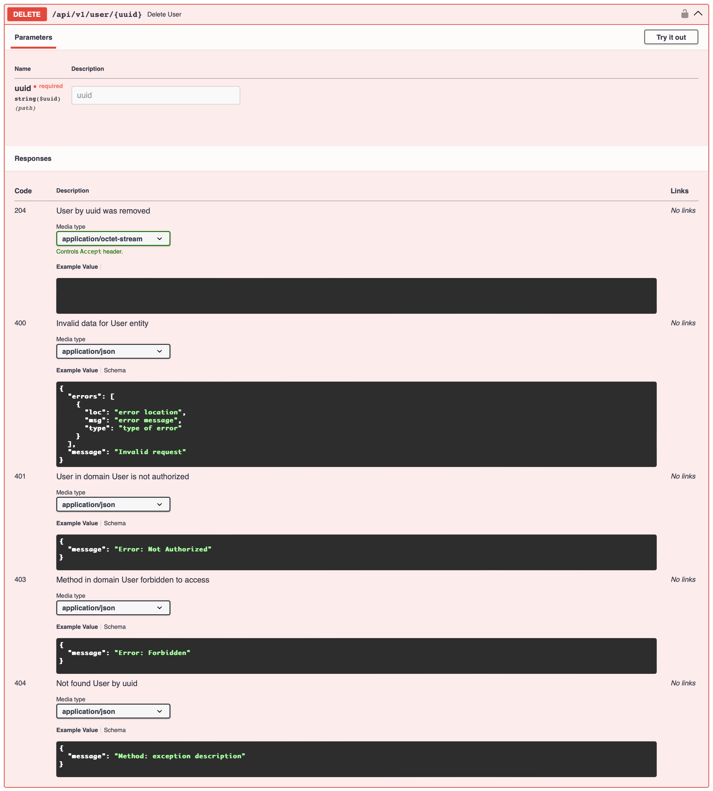
  </details>


## Добавить авторизацию в сторонний сервис

<details>
  <summary> Уточнения </summary>

  > УТОЧНЕНИЯ:
  > 1. Файлы типа domain.py - файлы доменных имен (library, book и тд)
</details>
<br/>

Чтобы добавить в сервис авторизацию:

1. Создаются следующие файлы (все они, кроме констант, не привязаны к сервису, то есть одинаковы на каждом сервисе):
  * **enums**
    * *enums.py* - необходимые енумы
  * **schemas**
    * *api_response.py* - ответы для документации swagger
      <details>
      <summary> Важное уточнение об изменении </summary>

      > УТОЧНЕНИЕ: данный файл подменяет файл *enums/responses.py* единым классом **ApiResponses** ответов документации.
      > Нужен для упрощения кода, путем замены енумов на один общий класс, которму передается имя домена из енума
      > **DomainEnum** из файла *enums/enums.py*. 
      > 
      > Если нет желания использовать данный класс, то можно в 
      > существующее решение добавить следующие ответы:
      > * *not_authorized* (использовать готовый класс ответа **NotAuthorizedResponse**)
      > * *forbidden* (использовать готовый класс ответа **ForbiddenResponse**)
      >
      > Далее будет описываться с учетом класса **ApiResponses**, но глобально это ни на что не повлияет

      </details>
      <br/>

    * *user.py* - класс пользователя, который получается при декодировании токена авторизации
  * **utils**
    * *addons.py* - вспомогательные функции
    * *api_requests.py* - отправить запросы - есть только гет, больше не нужно (нужен для получения **jwks** из сервиса авторизации)
    * *auth_user.py* - получения пользователя из токена, а также проверка роли
    * *consts.py* - константы, которые используются в файле настроек
    * *jwt.py* - декодирование токена авторизации
    * *validate.py* - отлов ошибок при валидации токена авторизации

2. Изменяются следующие файлы:
  * **enums**
    * *responses.py* (УДАЛЕН) - подробнее выше
  * **exceptions**
    * *http.py* - добавить ошибки:
      * *NotAuthorizedException*
      * *BadRequestException*
      * *ServiceUnavailableException*
      * *InvalidRequestException*
  * **routers**
    * *domain.py*:
      1. Обязательные изменения:
          1. Для проверки роли пользователя в каждый метод роутера (контроллера) добавляется в параметрах следующая строка:
          ```python
            _: bool = Depends(RoleChecker(allowed_roles=[RoleEnum.USER, RoleEnum.MODERATOR, ...])),
          ```
          Вызывается класс **RoleChecker**, которому передаются роли, с которыми пользователи могут воспользоваться данным методом, иначе код ответа **403**
          > УТОЧНЕНИЕ: На роль **RoleEnum.ADMIN** проверять не нужно, так как админ по умолчанию имеет доступ ко всему
          
          2. В параметр *responses* переменной **router** передать следующие два ответа для документации swagger (класс **ApiResponses**, смотретьч выше):
          ```python
            status.HTTP_401_UNAUTHORIZED: ApiResponses.not_authorized(DomainEnum.BOOK),
            status.HTTP_403_FORBIDDEN: ApiResponses.forbidden(DomainEnum.BOOK),
          ```

          3. Если нужно использовать данные пользователя (логин и тд): В параметры роутера (контроллера) добавляется следующая строка:
              ```python
                user: UserPayloadDto = Depends(get_current_user),
              ```

              В классе **UserPayloadDto** содержится следующая иноформация (в зависимости от *scope*, переданном в сервисе авторизации):
              ```python
                class UserPayloadDto(BaseModel):
                  sub: UUID                         # scope: openid, email, profile
                  login: str                        # scope: openid, email, profile
                  role: RoleEnum                    # scope: openid, email, profile
                  email: EmailStr | None = None     # scope: email
                  phone: PhoneNumber | None = None  # scope: profile
                  lastname: str | None = None       # scope: profile
                  firstname: str | None = None      # scope: profile
                  type: str | None = None           # scope: openid, email, profile
                  exp: datetime                     # scope: openid, email, profile
                  iat: datetime                     # scope: openid, email, profile
              ```

          4. Если сервис **GATEWAY**: Необходимо также отдельно получать *token*, чтобы прокидывать его на другие сервисы. В параметры роутера (контроллера) добавляется следующая строка:
              ```python
                token: HTTPAuthorizationCredentials | None = Depends(http_bearer)
              ```

              Структура **HTTPAuthorizationCredentials** (из библиотеки **FastAPI**):
              ```python
                class HTTPAuthorizationCredentials(BaseModel):
                  scheme: str      # тип токена: Bearer
                  credentials: str # токен
              ```

              Токен необходимо прокинуть до уровня отправки запроса на сторонний сервис. В каждый запрос добавить параметр **header**:
              ```python
                headers={
                  "Authorization": token.scheme+" "+token.credentials,
                },
              ```

      2. Необязательные изменения (были проведены в данном сервисе, могут быть пропущены):
          1. Заменить все остальные *responses* ответы документации **swagger** на класс **ApiResponses** (обязательно, если было решено использовать его) (В **GATEWAY** сервисе они особенные, смотреть сам сервис **GATEWAY**)
          2. Вынести параметры *db* и *domainCRUD* в отдельную функцию и получать непосредственно сервис:
              ```python
              def get_domain_service(
                domain_crud: Annotated[DomainCRUD, Depends(get_domain_crud)],
                db: Annotated[Session, Depends(get_db)],
              ) -> DomainService:
                return DomainService(
                  domainCRUD=domain_crud,
                  db=db,
                )
              ```
              И использовать его в параметрах каждого метода роутера (соответственно, вызывать методы данной переменной):
              ```python
              domain_service: Annotated[DomainService, Depends(get_domain_service)],
              ```
          3. Для декоратора методов контроллера добавить четко *path* для путей
          4. Заменить безымянные респонсы на готовые классы из файла [*schemas/response.py*](./schemas/response.py)
          5. В схемы вынесены параметры фильтрации

  * **schemas**
    * *domain.py* (необязательные изменения):
      1. Можно убрать **warnings** от *constr* и *conint*, добавив **Annotated**:
      ```python
      field: Annotated[str, constr(max_length=255)]
      ```
    * *response.py* (необязательные изменения)
        1. Добавлены классы ответов для **return** в методах роутера (контроллера)

  * **utils**
    * *database.py* (необязательные изменения):
      1. Функция получения строки бд перенесена из файла *utils/settings.py* в данный и при этом переписана (переписать ее обязательно, настройки получаются по-другому)

    * *settings.py* (обязательные изменения):
      1. Новые настройки

  * *main.py* (обязательные изменения):
    1. Получение настроек
    ```python
    settings = get_settings()
    ```

    2. Запуск сервиса, получая новые настройки:
    ```python
    uvicorn.run(
      "main:app", 
      host=settings.options.service.host,
      port=settings.options.service.port,
      log_level=settings.options.service.log_level,
      reload=settings.options.service.reload,
    )
    ```

  * *config.yml* (обязательные изменения):
    1. Поле *kid* (айди ключа **jwks**) в настройках сервиса авторизации (будет нужно всем сервисам)


## Технологии и термины

1. [IdentityProvider](https://habr.com/ru/articles/779170/)
2. [OpenIDConnect](https://habr.com/ru/companies/nixys/articles/566910/)
3. [Bearer](https://www.diera.ru/blog/bearer-token/)
4. [JWT](https://habr.com/ru/articles/340146/)
5. [JWK/JWKSet](https://wiki.openbankingrussia.ru/security/json-web-key-structure)

## Библиотеки

1. [JWCrypto](https://jwcrypto.readthedocs.io/en/latest/)
2. [bcrypt](https://pypi.org/project/bcrypt/)

## Вдохновение

1. [JWT/JWKS](https://www.emqx.com/en/blog/jwt-authentication-and-jwks-endpoint-in-mqtt)
2. [Аутентификация FastAPI](https://youtu.be/Fg4tfUtJiT8?si=9m9DlqGuvFwPI4a1)
3. [JWT Acess Token в FastAPI](https://youtu.be/B_JDYLXS8Ww?si=PQeR-KWnNotRmUZM)
4. [JWT Refresh Token в FastAPI](https://youtu.be/sgEvwwpEh7s?si=xFTQEWcxEcocQQpR)

***
[@amunra2](https://t.me/amunra2), 2024
